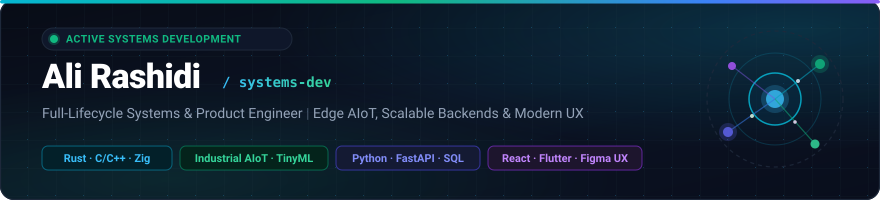

<div align="center">

<p align="center">
  <a href="#overview">🌐 <strong>English</strong></a> &nbsp;•&nbsp; <a href="#persian-about">🇮🇷 <strong>فارسی</strong></a>
</p>

<!-- Systems & AIoT Engineer Modern Header Banner (Dark & Light Mode) -->
<a href="https://github.com/Ali-Rashidi-80">
  <picture>
    <source media="(prefers-color-scheme: dark)" srcset="./assets/banner-dark.svg">
    <source media="(prefers-color-scheme: light)" srcset="./assets/banner-light.svg">
    
  </picture>
</a>

<!-- Typing Dynamic Tagline -->
<a href="https://rynix.ir">
  
</a>

<p align="center">
  <a href="https://rynix.ir"></a>
  <a href="https://github.com/Ali-Rashidi-80"></a>
  <a href="mailto:the.aliiiiiiii2001@gmail.com"></a>
  
  
</p>

</div>

---

<a id="overview"></a>
### ⚡ About Me

I'm a software engineer working across systems, embedded devices, and full-stack web and mobile apps. I care about writing maintainable code, understanding what happens under the hood, and building systems that perform reliably under real-world constraints.

- **Low-Level & Embedded:** Firmware development on `ESP32` microcontrollers, sensor integration, and lightweight `TinyML` inference using `Rust` and `C/C++`.
- **Backend & Data:** Asynchronous APIs with `Python` (`FastAPI`), relational database design and caching (`PostgreSQL`, `SQLite`, `Redis`), and offline-first data sync.
- **Frontend, Mobile & UI/UX:** Web applications (`TypeScript`, `React`, `Next.js`) and cross-platform mobile apps (`Flutter`, `Dart`), with user interfaces prototyped in `Figma`.
- **Product & Delivery:** Building usable 0-to-1 MVPs from clear requirements, keeping architectures clean and modular, and writing automated tests (`TDD`).

---

### 🛠️ Domains & Toolchain

```text
Systems & Embedded  │ Rust · Zig · C · C++ · Go · Arduino · Raspberry Pi · OpenCV
Backend & Databases │ Python · FastAPI · PostgreSQL · SQLite · Redis
Frontend & Mobile   │ TypeScript · React · Next.js · Vite · Tailwind · Flutter · Dart
Cloud & DevOps      │ Docker · Kubernetes · Nginx · Cloudflare · GCP · Vercel · Linux
Tooling & Workflow  │ Git · GitHub · VS Code · Postman · PowerShell · pnpm · Gradle
Creative & Engines  │ Unity · Unreal Engine · Figma · Photoshop · Premiere · After Effects
```

<div align="center">

<p align="center">
  <b>⚡ Systems, Low-Level &amp; Embedded</b><br />
  <a href="https://skillicons.dev"></a>
</p>

<p align="center">
  <b>🗄️ Backend, Databases &amp; Services</b><br />
  <a href="https://skillicons.dev"></a>
</p>

<p align="center">
  <b>🌐 Frontend, Mobile &amp; Web</b><br />
  <a href="https://skillicons.dev"></a>
</p>

<p align="center">
  <b>☁️ Cloud, DevOps &amp; Infrastructure</b><br />
  <a href="https://skillicons.dev"></a>
</p>

<p align="center">
  <b>🛠️ Tools, Environment &amp; Package Managers</b><br />
  <a href="https://skillicons.dev"></a>
</p>

<p align="center">
  <b>🎮 Game Development &amp; Creative Media</b><br />
  <a href="https://skillicons.dev"></a>
</p>

</div>

<details>
<summary><b>🔍 Engineering Practices & Standards (Click to expand)</b></summary>
<br />

| Focus Area | Practices & Tooling |
| :--- | :--- |
| **Code Quality & Testing** | Static typing, defensive error handling, automated tests (TDD), CI pipelines |
| **Embedded & Systems** | ESP32-S3, Arduino, Modbus RTU / RS485, logic analyzers, memory-conscious design |
| **Backend & Services** | Clean API design, schema migrations, local-first caching, graceful offline handling |
| **Frontend & UI/UX** | Figma component workflows, responsive web/mobile layouts, accessibility (a11y), predictable state |
| **Product & Delivery** | Rapid 0-to-1 MVP builds, modular architecture, Architecture Decision Records (ADRs), clean git workflow |

</details>

---

### 📂 Repositories & Projects

Featured projects and active codebases are pinned at the top of this profile.

To explore all public repositories, tools, and experiments:
👉 **[Browse All Repositories](https://github.com/Ali-Rashidi-80?tab=repositories)**

---

### 📊 Contribution Matrix & Metrics

<div align="center">

<!-- Snake Eating Contributions Animation -->
<picture>
  <source media="(prefers-color-scheme: dark)" srcset="./dist/github-contribution-grid-snake-dark.svg">
  <source media="(prefers-color-scheme: light)" srcset="./dist/github-contribution-grid-snake.svg">
  
</picture>

<table border="0" width="100%">
  <tr>
    <td width="50%" align="center">
      <picture>
        <source media="(prefers-color-scheme: dark)" srcset="https://github-readme-stats-eight-theta.vercel.app/api?username=Ali-Rashidi-80&show_icons=true&bg_color=080c16&title_color=38bdf8&text_color=94a3b8&icon_color=10b981&border_color=1e293b&count_private=true">
        <source media="(prefers-color-scheme: light)" srcset="https://github-readme-stats-eight-theta.vercel.app/api?username=Ali-Rashidi-80&show_icons=true&bg_color=f8fafc&title_color=0284c7&text_color=475569&icon_color=059669&border_color=cbd5e1&count_private=true">
        
      </picture>
    </td>
    <td width="50%" align="center">
      <picture>
        <source media="(prefers-color-scheme: dark)" srcset="https://github-readme-stats-eight-theta.vercel.app/api/top-langs/?username=Ali-Rashidi-80&layout=compact&bg_color=080c16&title_color=38bdf8&text_color=94a3b8&border_color=1e293b&langs_count=8">
        <source media="(prefers-color-scheme: light)" srcset="https://github-readme-stats-eight-theta.vercel.app/api/top-langs/?username=Ali-Rashidi-80&layout=compact&bg_color=f8fafc&title_color=0284c7&text_color=475569&border_color=cbd5e1&langs_count=8">
        
      </picture>
    </td>
  </tr>
</table>

<p align="center">
  <picture>
    <source media="(prefers-color-scheme: dark)" srcset="https://streak-stats.demolab.com?user=Ali-Rashidi-80&background=080c16&border=1e293b&stroke=1e293b&ring=10b981&fire=10b981&currStreakNum=38bdf8&sideNums=38bdf8&currStreakLabel=10b981&sideLabels=94a3b8&dates=64748b">
    <source media="(prefers-color-scheme: light)" srcset="https://streak-stats.demolab.com?user=Ali-Rashidi-80&background=f8fafc&border=cbd5e1&stroke=cbd5e1&ring=059669&fire=059669&currStreakNum=0284c7&sideNums=0284c7&currStreakLabel=059669&sideLabels=475569&dates=64748b">
    
  </picture>
</p>

</div>

---

<a id="persian-about"></a>

<div dir="rtl">

### 🌐 درباره من

من **علی رشیدی** هستم؛ توسعه‌دهنده نرم‌افزار با تمرکز بر سیستم‌های سطح‌پایین، سخت‌افزارهای تعبیه‌شده <bdi>(Embedded / AIoT)</bdi> و توسعه نرم‌افزارهای وب و موبایل.

حوزه کاری من شامل لایه‌های مختلف توسعه نرم‌افزار است؛ از کدنویسی میکروکنترلرها تا پیاده‌سازی وب‌سرویس‌ها و رابط‌های کاربری:

* **سیستم‌های سطح‌پایین و امبدد:** برنامه‌نویسی با <bdi>**Rust**</bdi> و <bdi>**C/C++**</bdi> برای میکروکنترلرهای <bdi>**(ESP32)**</bdi>، کار با پروتکل‌های ارتباطی و سنسورهای صنعتی، و اجرای مدل‌های فشرده هوش مصنوعی <bdi>**(TinyML)**</bdi>.
* **بک‌اند و پایگاه داده:** توسعه وب‌سرویس‌های ناهمگام با پایتون <bdi>**(FastAPI)**</bdi>، مدیریت داده‌ها و کش با <bdi>**(PostgreSQL / SQLite / Redis)**</bdi>، و طراحی سیستم‌های مقاوم با همگام‌سازی محلی داده‌ها <bdi>**(Local-First)**</bdi>.
* **فرانت‌اند، موبایل و UI/UX:** پیاده‌سازی برنامه‌های وب و موبایل با <bdi>**TypeScript**</bdi>، <bdi>**React**</bdi>، <bdi>**Next.js**</bdi> و <bdi>**Flutter**</bdi>، به همراه پروتوتایپ و دیزاین سیستم در <bdi>**Figma**</bdi>.
* **توسعه محصول و MVP:** تحویل سریع نمونه‌های اولیه کاربردی <bdi>**(0-to-1 MVP)**</bdi> با ساختار ماژولار، کد تمیز و پوشش آزمون‌های خودکار <bdi>**(TDD)**</bdi>.

<br />

<div align="center">

<p align="center">
  <a href="mailto:the.aliiiiiiii2001@gmail.com"></a>
  <a href="https://rynix.ir"></a>
  
</p>

<p align="center">
  <a href="#overview"><b>↑ بازگشت به ابتدای صفحه (Back to Top)</b></a>
</p>

</div>

</div>
